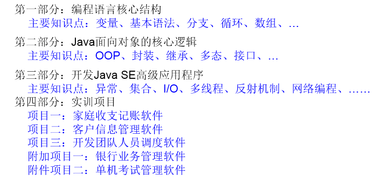
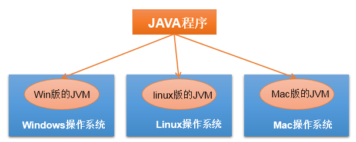
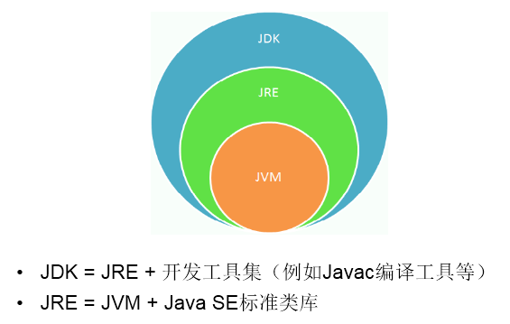
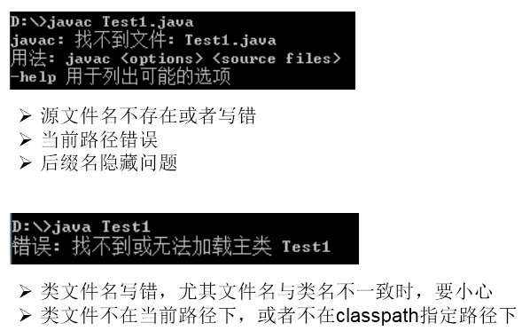
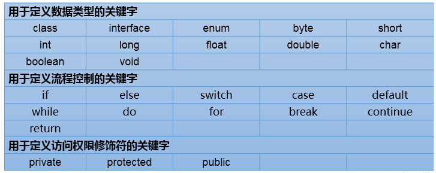
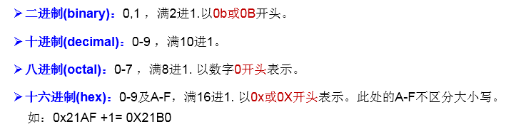
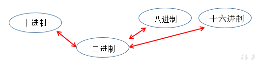
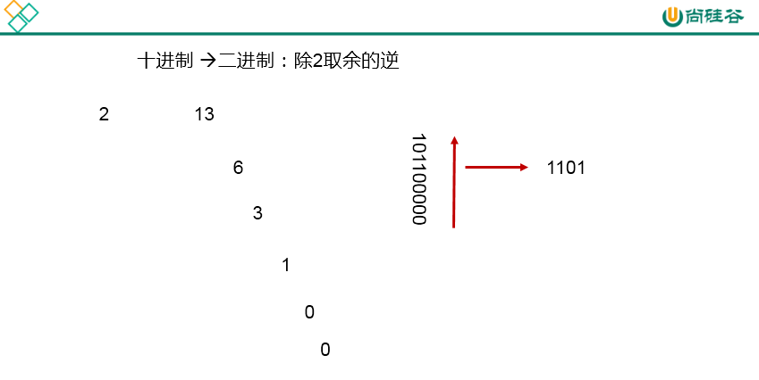

# JavaSE


## 一、Java基础


### 1、Java语言概述

#### ①、课程概述





项目一：讲完流程控制时，可以做。第二章结束
项目二：讲完第四章面向对象（上），可以做
项目三：讲完第七章异常处理以后，可以做

附加项目一：讲完第七章异常处理以后，可以做
附加项目二：讲完第11章IO流以后，可以做


#### ②、Java语言概述

1.基础常识
软件：即一系列按照特定顺序组织的计算机数据和指令的集合。分为：系统软件 和 应用软件	
	系统软件：windows , mac os , linux ,unix,android,ios,....
  应用软件：word ,ppt,画图板,...
人机交互方式： 图形化界面  vs  命令行方式
应用程序 = 算法 + 数据结构
常用DOS命令：


2.计算机语言的发展迭代史
第一代：机器语言
第二代：汇编语言
第三代：高级语言
> 面向过程：C,Pascal、Fortran
> 面向对象：Java,JS,Python,Scala,...
> 3.Java语言版本迭代概述
> 1991年 Green项目，开发语言最初命名为Oak (橡树)
> 1994年，开发组意识到Oak 非常适合于互联网
> 1996年，发布JDK 1.0，约8.3万个网页应用Java技术来制作
> 1997年，发布JDK 1.1，JavaOne会议召开，创当时全球同类会议规模之最
> 1998年，发布JDK 1.2，同年发布企业平台J2EE
> 1999年，Java分成J2SE、J2EE和J2ME，JSP/Servlet技术诞生
> 2004年，发布里程碑式版本：JDK 1.5，为突出此版本的重要性，更名为JDK 5.0
> 2005年，J2SE -> JavaSE，J2EE -> JavaEE，J2ME -> JavaME
> 2009年，Oracle公司收购SUN，交易价格74亿美元
> 2011年，发布JDK 7.0
> 2014年，发布JDK 8.0，是继JDK 5.0以来变化最大的版本
> 2017年，发布JDK 9.0，最大限度实现模块化
> 2018年3月，发布JDK 10.0，版本号也称为18.3
> 2018年9月，发布JDK 11.0，版本号也称为18.9

4.Java语言应用的领域：
>Java Web开发：后台开发
>大数据开发：
>Android应用程序开发：客户端开发
>5.Java语言的特点
>面向对象性：
>两个要素：类、对象
>三个特征：封装、继承、多态
>健壮性：① 去除了C语言中的指针 ②自动的垃圾回收机制 -->仍然会出现内存溢出、内存泄漏
>跨平台型：write once,run anywhere:一次编译，到处运行
>功劳归功于：JVM




#### ③、开发环境的搭建（重点）

1.1 JDK、JRE、JVM的关系



  1.2 JDK的下载、安装
  下载：官网，github
  安装：傻瓜式安装：JDK 、JRE
     注意问题：安装软件的路径中不能包含中文、空格。

1.3 path环境变量的配置
  1.3.1 为什么配置path环境变量？
  path环境变量：windows操作系统执行命令时所要搜寻的路径
  为什么要配置path:希望java的开发工具（javac.exe,java.exe)在任何的文件路径下都可以执行成功。
  1.3.2 如何配置？


#### ④、第一个Java程序

1.开发体验——HelloWorld


 1.1 编写
  创建一个java源文件：HelloWorld.java

```java
  class HelloChina{
  	public static void main(String[] args){
  		System.out.println("Hello,World!");
  	}
  }
```


 1.2 编译：
  javac HelloWorld.java
  1.3 运行：
  java HelloChina

- 2.常见问题的解决




3.总结第一个程序
 1. java程序编写-编译-运行的过程
    编写：我们将编写的java代码保存在以".java"结尾的源文件中
    编译：使用javac.exe命令编译我们的java源文件。格式：javac 源文件名.java
    运行：使用java.exe命令解释运行我们的字节码文件。 格式：java 类名
    2.
    在一个java源文件中可以声明多个class。但是，只能最多有一个类声明为public的。
    而且要求声明为public的类的类名必须与源文件名相同。
  3. 程序的入口是main()方法。格式是固定的。
  4. 输出语句：
    System.out.println():先输出数据，然后换行
    System.out.print():只输出数据
    5.每一行执行语句都以";"结束。
    6.编译的过程：编译以后，会生成一个或多个字节码文件。字节码文件的文件名与java源文件中的类名相同。


### 2、基本语法

#### ①、关键字与标识符

1.java关键字的使用
定义：被Java语言赋予了特殊含义，用做专门用途的字符串（单词）
特点：关键字中所字母都为小写
具体哪些关键字：




2.保留字：现Java版本尚未使用，但以后版本可能会作为关键字使用。
具体哪些保留字：goto 、const
注意：自己命名标识符时要避免使用这些保留字

3.标识符的使用
定义：**凡是自己可以起名字的地方都叫标识符。**
涉及到的结构：
包名、类名、接口名、变量名、方法名、常量名
规则：(必须要遵守。否则，编译不通过)


规范：（可以不遵守，不影响编译和运行。但是要求大家遵守）


注意点： 
在起名字时，为了提高阅读性，要尽量意义，“见名知意”。


#### ②、变量的使用(重点)

1.变量的分类
1.1 按数据类型分类


详细说明：
```java
		//① byte范围：-128 ~ 127
	// ② 声明long型变量，必须以"l"或"L"结尾
		// ③ 通常，定义整型变量时，使用int型。
       //④整型的常量，默认类型是：int型
//2. 浮点型：float(4字节) \ double(8字节)
		//① 浮点型，表示带小数点的数值
		//② float表示数值的范围比long还大
	//③ 定义float类型变量时，变量要以"f"或"F"结尾
	//④ 通常，定义浮点型变量时，使用double型。
	//⑤ 浮点型的常量，默认类型为：double
//3. 字符型：char (1字符=2字节)
		//① 定义char型变量，通常使用一对'',内部只能写一个字符
	//② 表示方式：1.声明一个字符 2.转义字符 3.直接使用 Unicode 值来表示字符型常量
//4.布尔型：boolean
	//① 只能取两个值之一：true 、 false
	//② 常常在条件判断、循环结构中使用
```

```
```

1.2 按声明的位置分类(了解)


2.定义变量的格式：
数据类型  变量名 = 变量值;
或
数据类型  变量名;
变量名 = 变量值;

3.变量使用的注意点：
   ① 变量必须先声明，后使用
   ② 变量都定义在其作用域内。在作用域内，它是有效的。换句话说，出了作用域，就失效了
   ③ 同一个作用域内，不可以声明两个同名的变量

4.基本数据类型变量间运算规则
	4.1 涉及到的基本数据类型：除了boolean之外的其他7种
	4.2 自动类型转换(只涉及7种基本数据类型）
		结论：当容量小的数据类型的变量与容量大的数据类型的变量做运算时，结果自动提升为容量大的数据类型。
		byte 、char 、short --> int --> long --> float --> double 
		特别的：当byte、char、short三种类型的变量做运算时，结果为int型
说明：此时的容量大小指的是，表示数的范围的大和小。比如：float容量要大于long的容量

​	4.3 强制类型转换(只涉及7种基本数据类型）：自动类型提升运算的逆运算。
​		1.需要使用强转符：()
​		2.注意点：强制类型转换，可能导致精度损失。
​	4.4 String与8种基本数据类型间的运算

1. String属于引用数据类型,翻译为：字符串
2. 声明String类型变量时，使用一对""
3. String可以和8种基本数据类型变量做运算，且运算只能是连接运算：+
4. 运算的结果仍然是String类型
避免：
String s = 123;//编译错误
String s1 = "123";
int i = (int)s1;//编译错误


#### ③、进制

1.编程中涉及的进制及表示方式：



2.二进制的使用说明：
2.1 计算机底层的存储方式：所有数字在计算机底层都以二进制形式存在。
2.2 二进制数据的存储方式：所有的数值，不管正负，底层都以补码的方式存储。
2.3 原码、反码、补码的说明：


正数：三码合一
负数：

3.进制间的转换：
3.1 图示：



3.2 图示二进制转换为十进制：


3.3 图示十进制转换为二进制：



3.4 二进制与八进制、十六进制间的转换：


#### ④、运算符

##### 1-算数运算符

1.算术运算符： + - + - * / % (前)++ (后)++ (前)-- (后)-- + 
【典型代码】

```JAVA
	//除号：/
	int num1 = 12;
	int num2 = 5;
	int result1 = num1 / num2;
	System.out.println(result1);//2
	// %:取余运算
	//结果的符号与被模数的符号相同
	//开发中，经常使用%来判断能否被除尽的情况。
	int m1 = 12;
	int n1 = 5;
	System.out.println("m1 % n1 = " + m1 % n1);
	int m2 = -12;
	int n2 = 5;
	System.out.println("m2 % n2 = " + m2 % n2);

	int m3 = 12;
	int n3 = -5;
	System.out.println("m3 % n3 = " + m3 % n3);

	int m4 = -12;
	int n4 = -5;
	System.out.println("m4 % n4 = " + m4 % n4);
	//(前)++ :先自增1，后运算
	//(后)++ :先运算，后自增1
	int a1 = 10;
	int b1 = ++a1;
	System.out.println("a1 = " + a1 + ",b1 = " + b1);
	
	int a2 = 10;
	int b2 = a2++;
	System.out.println("a2 = " + a2 + ",b2 = " + b2);
	
	int a3 = 10;
	++a3;//a3++;
	int b3 = a3;
	//(前)-- :先自减1，后运算
	//(后)-- :先运算，后自减1
	
	int a4 = 10;
	int b4 = a4--;//int b4 = --a4;
	System.out.println("a4 = " + a4 + ",b4 = " + b4);
```
【特别说明的】
1.//(前)++ :先自增1，后运算
 //(后)++ :先运算，后自增1
2.//(前)-- :先自减1，后运算
  //(后)-- :先运算，后自减1
3.连接符：+：只能使用在String与其他数据类型变量之间使用。


##### 2-赋值运算符

2.赋值运算符：=  +=  -=  *=  /=  %= 
【典型代码】
	

```java
	int i2,j2;
	//连续赋值
	i2 = j2 = 10;
	//***************
	int i3 = 10,j3 = 20;
	int num1 = 10;
	num1 += 2;//num1 = num1 + 2;
	System.out.println(num1);//12
	int num2 = 12;
	num2 %= 5;//num2 = num2 % 5;
	System.out.println(num2);

	short s1 = 10;
	//s1 = s1 + 2;//编译失败
	s1 += 2;//结论：不会改变变量本身的数据类型
	System.out.println(s1);
```

【特别说明的】
1.运算的结果不会改变变量本身的数据类型
2.
		//开发中，如果希望变量实现+2的操作，有几种方法？(前提：int num = 10;)
		//方式一：num = num + 2;
		//方式二：num += 2; (推荐)
		

//开发中，如果希望变量实现+1的操作，有几种方法？(前提：int num = 10;)
	//方式一：num = num + 1;
	//方式二：num += 1; 
	//方式三：num++; (推荐)

​	

##### 3-比较运算符

3.比较运算符（关系运算符）: == != >  <  >=  <=  instanceof
【典型代码】

```java
	int i = 10;
	int j = 20;
	System.out.println(i == j);//false
	System.out.println(i = j);//20

	boolean b1 = true;
	boolean b2 = false;
	System.out.println(b2 == b1);//false
	System.out.println(b2 = b1);//true
```
【特别说明的】
1.比较运算符的结果是boolean类型
2.>  <  >=  <= :只能使用在数值类型的数据之间。

3. == 和 !=: 不仅可以使用在数值类型数据之间，还可以使用在其他引用类型变量之间。
Account acct1 = new Account(1000);
Account acct2 = new Account(1000);
boolean b1 = (acct1 == acct2);//比较两个Account是否是同一个账户。
boolean b2 = (acct1 != acct2);//


##### 4-逻辑运算符

4.逻辑运算符：& &&  |  || !  ^
【典型代码】
		//区分& 与 &&
		//相同点1：& 与  && 的运算结果相同
		//相同点2：当符号左边是true时，二者都会执行符号右边的运算
		//不同点：当符号左边是false时，&继续执行符号右边的运算。&&不再执行符号右边的运算。
		//开发中，推荐使用&&
		boolean b1 = true;
		b1 = false;
		int num1 = 10;
		if(b1 & (num1++ > 0)){
			System.out.println("我现在在北京");
		}else{
			System.out.println("我现在在南京");
		}

		System.out.println("num1 = " + num1);


```java
	boolean b2 = true;
	b2 = false;
	int num2 = 10;
	if(b2 && (num2++ > 0)){
		System.out.println("我现在在北京");
	}else{
		System.out.println("我现在在南京");
	}

	System.out.println("num2 = " + num2);

	// 区分：| 与 || 
	//相同点1：| 与  || 的运算结果相同
	//相同点2：当符号左边是false时，二者都会执行符号右边的运算
	//不同点3：当符号左边是true时，|继续执行符号右边的运算，而||不再执行符号右边的运算
	//开发中，推荐使用||
	boolean b3 = false;
	b3 = true;
	int num3 = 10;
	if(b3 | (num3++ > 0)){
		System.out.println("我现在在北京");
	}else{
		System.out.println("我现在在南京");
	}
	System.out.println("num3 = " + num3);
	boolean b4 = false;
	b4 = true;
	int num4 = 10;
	if(b4 || (num4++ > 0)){
		System.out.println("我现在在北京");
	}else{
		System.out.println("我现在在南京");
	}
	System.out.println("num4 = " + num4);
```


【特别说明的】
1.逻辑运算符操作的都是boolean类型的变量。而且结果也是boolean类型


##### 5-位运算符

5.位运算符：<<  >> >>> &  |  ^  ~
【典型代码】
		

```java
	int i = 21;
	i = -21;
	System.out.println("i << 2 :" + (i << 2));
	System.out.println("i << 3 :" + (i << 3));
	System.out.println("i << 27 :" + (i << 27));
	int m = 12;
	int n = 5;
	System.out.println("m & n :" + (m & n));
	System.out.println("m | n :" + (m | n));
	System.out.println("m ^ n :" + (m ^ n));
```
【面试题】 你能否写出最高效的2 * 8的实现方式？ 
答案：2 << 3  或  8 << 1
【特别说明的】
1. 位运算符操作的都是整型的数据
2. << ：在一定范围内，每向左移1位，相当于 * 2
   
   >> :在一定范围内，每向右移1位，相当于 / 2

典型题目：
1.交换两个变量的值。
2.实现60的二进制到十六进制的转换


##### 6-三元运算符

6.三元运算符：(条件表达式)? 表达式1 : 表达式2
【典型代码】
1.获取两个整数的较大值
2.获取三个数的最大值
【特别说明的】
1. 说明
① 条件表达式的结果为boolean类型
② 根据条件表达式真或假，决定执行表达式1，还是表达式2.
    如果表达式为true，则执行表达式1。
    如果表达式为false，则执行表达式2。
③ 表达式1 和表达式2要求是一致的。
④ 三元运算符可以嵌套使用
2. 
凡是可以使用三元运算符的地方，都可以改写为if-else
反之，不成立。
3. 如果程序既可以使用三元运算符，又可以使用if-else结构，那么优先选择三元运算符。原因：简洁、执行效率高。


#### ⑤、流程控制

顺序结构：程序从上到下执行。

分支结构：
if-else if - else
switch-case

循环结构：
for
while
do-while


##### 1-分支结构

1.if-else条件判断结构
1.1.
结构一：
if(条件表达式){
	执行表达式
}

结构二：二选一
if(条件表达式){
	执行表达式1
}else{
	执行表达式2
}

结构三：n选一
if(条件表达式){
	执行表达式1
}else if(条件表达式){
	执行表达式2
}else if(条件表达式){
	执行表达式3
}
...
else{
	执行表达式n
}

1.2.说明：
1. else 结构是可选的。
2. 针对于条件表达式：
   > 如果多个条件表达式之间是“互斥”关系(或没有交集的关系),哪个判断和执行语句声明在上面还是下面，无所谓。
   > 如果多个条件表达式之间有交集的关系，需要根据实际情况，考虑清楚应该将哪个结构声明在上面。
   > 如果多个条件表达式之间有包含的关系，通常情况下，需要将范围小的声明在范围大的上面。否则，范围小的就没机会执行了。
3. if-else结构是可以相互嵌套的。
4. 如果if-else结构中的执行语句只有一行时，对应的一对{}可以省略的。但是，不建议大家省略。

2.switch-case选择结构

```java
switch(表达式){
case 常量1:
	执行语句1;
	//break;
case 常量2:
	执行语句2;
	//break;
...
default:
	执行语句n;
	//break;
}
```

2.说明：
① 根据switch表达式中的值，依次匹配各个case中的常量。一旦匹配成功，则进入相应case结构中，调用其执行语句。
  当调用完执行语句以后，则仍然继续向下执行其他case结构中的执行语句，直到遇到break关键字或此switch-case结构
  末尾结束为止。
② break,可以使用在switch-case结构中，表示一旦执行到此关键字，就跳出switch-case结构
③ switch结构中的表达式，只能是如下的6种数据类型之一：
   byte 、short、char、int、枚举类型(JDK5.0新增)、String类型(JDK7.0新增)
④ case 之后只能声明常量。不能声明范围。
⑤ break关键字是可选的。
⑥ default:相当于if-else结构中的else.  
  default结构是可选的，而且位置是灵活的。
3.如果switch-case结构中的多个case的执行语句相同，则可以考虑进行合并。
4.break在switch-case中是可选的


##### 2-循环结构

1.循环结构的四要素
① 初始化条件
② 循环条件  --->是boolean类型
③ 循环体
④ 迭代条件
说明：通常情况下，循环结束都是因为②中循环条件返回false了。

2.三种循环结构：
2.1 for循环结构
for(①;②;④){
	③
}
执行过程：① - ② - ③ - ④ - ② - ③ - ④ - ... - ②
2.2 while循环结构
①
while(②){
	③;
	④;
}
执行过程：① - ② - ③ - ④ - ② - ③ - ④ - ... - ②
说明：
写while循环千万小心不要丢了迭代条件。一旦丢了，就可能导致死循环！

for和while循环总结：
1. 开发中，基本上我们都会从for、while中进行选择，实现循环结构。
2. for循环和while循环是可以相互转换的！ 
    区别：for循环和while循环的初始化条件部分的作用范围不同。
3. 我们写程序，要避免出现死循环。
2.3 do-while循环结构
①
do{
	③;
	④;
}while(②);
执行过程：① - ③ - ④ - ② - ③ - ④ - ... - ②

说明：
1.do-while循环至少会执行一次循环体！
2.开发中，使用for和while更多一些。较少使用do-while

3.“无限循环”结构: while(true) 或 for(;;)
总结：如何结束一个循环结构？
方式一：当循环条件是false时
方式二：在循环体中，执行break

4.嵌套循环
1.嵌套循环:将一个循环结构A声明在另一个循环结构B的循环体中,就构成了嵌套循环
  内层循环：循环结构A
  外层循环：循环结构B
2.说明：
① 内层循环结构遍历一遍，只相当于外层循环循环体执行了一次
② 假设外层循环需要执行m次，内层循环需要执行n次。此时内层循环的循环体一共执行了m * n次
③ 外层循环控制行数，内层循环控制列数
【典型练习】
		//练习一：

```java
	/*
		******
		******
		******
		******
		*/	for(int j = 1;j <= 4;j++ ){
			for(int i = 1;i <= 6;i++){
				System.out.print('*');
			}
			System.out.println();
		}
```


​		//练习二：
​		/*			i(行号)		j(*的个数)

		*			1			1
		**			2			2
		***			3			3
		****		4			4
		*****		5			5
		*/

```java
	for(int i = 1;i <= 5;i++){//控制行数
		for(int j = 1;j <= i;j++){//控制列数
			System.out.print("*");
		
		}
		System.out.println();
	}
	//练习三：九九乘法表
	//练习四：100以内的质数
```

补充:衡量一个功能代码的优劣：
1.正确性
2.可读性
3.健壮性
4.高效率与低存储：时间复杂度 、空间复杂度 （衡量算法的好坏）

如何理解流程控制的练习：
流程控制结构的使用 + 算法逻辑


##### 3-break和continue

break和continue关键字的使用
			使用范围		循环中使用的作用(不同点)		相同点
break:		switch-case			
			循环结构中		结束当前循环					关键字后面不能声明执行语句	

continue:		循环结构中		结束当次循环					关键字后面不能声明执行语句

补充：带标签的break和continue的使用

return在方法中讲。


##### 4-Scanner类的使用

```java
/*
如何从键盘获取不同类型的变量：需要使用Scanner类

具体实现步骤：
1.导包：import java.util.Scanner;
2.Scanner的实例化:Scanner scan = new Scanner(System.in);
3.调用Scanner类的相关方法（next() / nextXxx()），来获取指定类型的变量

注意：
需要根据相应的方法，来输入指定类型的值。如果输入的数据类型与要求的类型不匹配时，会报异常：InputMisMatchException
导致程序终止。
*/
//1.导包：import java.util.Scanner;
import java.util.Scanner;

class ScannerTest{
public static void main(String[] args){
	//2.Scanner的实例化
	Scanner scan = new Scanner(System.in);
	
	//3.调用Scanner类的相关方法
	System.out.println("请输入你的姓名：");
	String name = scan.next();
	System.out.println(name);

	System.out.println("请输入你的芳龄：");
	int age = scan.nextInt();
	System.out.println(age);

	System.out.println("请输入你的体重：");
	double weight = scan.nextDouble();
	System.out.println(weight);

	System.out.println("你是否相中我了呢？(true/false)");
	boolean isLove = scan.nextBoolean();
	System.out.println(isLove);

	//对于char型的获取，Scanner没有提供相关的方法。只能获取一个字符串
	System.out.println("请输入你的性别：(男/女)");
	String gender = scan.next();//"男"
	char genderChar = gender.charAt(0);//获取索引为0位置上的字符
	System.out.println(genderChar);	
	}
}
```
