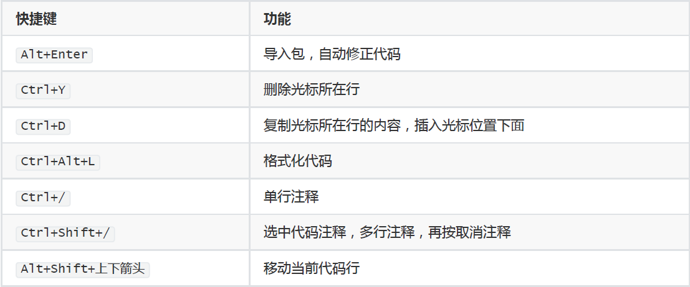

# JavaSE


## 一、Java基础

### 1、开发工具

>  IDEA

IDEA先新建项目，接着是模块，然后是包和类

常用快捷键



删除模块：先移除模块，再在磁盘文件上面删除


### 2、基础

#### 字面量

作用：告诉程序员，数据在程序中的书写格式。

| **字面量类型** | **说明**                                  | **程序中的写法**           |
| -------------- | ----------------------------------------- | -------------------------- |
| 整数           | 不带小数的数字                            | 666，-88                   |
| 小数           | 带小数的数字                              | 13.14，-5.21               |
| 字符           | 必须使用单引号，有且仅能一个字符          | ‘A’，‘0’，   ‘我’          |
| 字符串         | 必须使用双引号，内容可有可无              | “HelloWorld”，“黑马程序员” |
| 布尔值         | 布尔值，表示真假，只有两个值：true，false | true 、false               |
| 空值           | 一个特殊的值，空值                        | 值是：null                 |


#### 变量

变量就是用来存储数据的一片内存空间

变量的定义：

```
数据类型  变量名称 = 初始值
```

