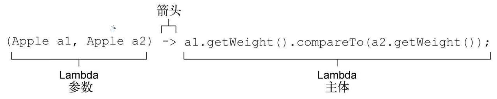
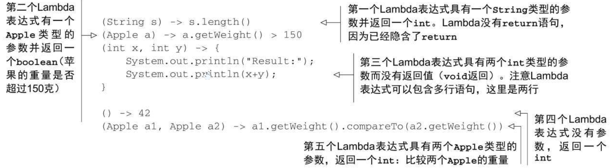
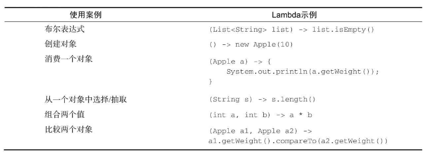

# 《Java8实战》笔记

## 1、行为参数化

（1）传递代码/行为

谓词：返回值是boolean的函数

行为参数化：让方法接受多种行为作为参数，并在内部使用，来完成不同的行为。

```java
 interface ApplePredicate {
        public boolean test(Apple a);
 }
 public class AppleHeavyWeightPredicate implements ApplePredicate {
        public boolean test(Apple apple){
            return apple.getWeight() > 150;
        }
 }

   public class AppleGreenColorPredicate implements ApplePredicate{
        @Override
        public boolean test(Apple apple) {
            return "green".equals(apple.getColor());
        }
   }

  public static class AppleRedAndHeavyPredicate implements ApplePredicate {
        public boolean test(Apple apple){
            return "red".equals(apple.getColor()) && apple.getWeight()>150;
        }
   }

  public static List<Apple> filterApple(List<Apple> inventory,
                                          ApplePredicate p){
        List<Apple> result = new ArrayList<>();
        for (Apple apple:inventory){
            if (p.test(apple)){
                result.add(apple);
            }
        }
        return result;
   }
```

（2）多种行为，一个参数

```java
 public static void prettyPrintApple(List<Apple> inventory,
                                        AppleFormatter formatter){
        for (Apple apple:inventory){
            String output = formatter.accept(apple);
            System.out.println(output);
        }
   }
 
 interface AppleFormatter{
        String accept(Apple a);
    }
 
  public class AppleFancyFormatter implements AppleFormatter{
        @Override
        public String accept(Apple a) {
            String characteristic = a.getWeight()>150?"heavy":"light";
            return "A "+characteristic+" "+a.getColor()+" apple";
        }
    }

    public class AppleSimpleFormatter implements AppleFormatter {
        @Override
        public String accept(Apple a) {
            return "An apple of "+a.getWeight()+"g";
        }
    }
```

（3）对付啰嗦

> 1、匿名类

匿名类和你熟悉的Java局部类（块中定义的类）差不多，但匿名类没有名字。它允许你同时声明并实例化一个类。换句话说，它允许你随用随建。

```java
List<Apple> res = filter(inventory, new ApplePredicate() {
            @Override
            public boolean test(Apple a) {
                return "red".equals(a.getColor());
            }
});
```

> 2、Lambda表达式

使用Lambda表达式可以简化匿名类

```java
res = filter(inventory,(Apple apple)->{
            return "red".equals(apple.getColor());
 });
```

行为参数化并且使用Lambda来简化代码

```java
public static <T> List<T> filter(List<T> list, Predicate<T> p){
        List<T> result = new ArrayList<>();
        for (T e:list){
            if (p.test(e)){
                result.add(e);
            }
        }
        return result;
  } 


 List<Apple> redOfApples = filter(inventory,(Apple apple)-> "red".equals(apple.getColor()));
 List<Integer> evenNumbers = filter(Arrays.asList(new Integer[]
 {1,2,3,4,5,6,7,8,9,10}),
                (Integer i)->i%2==0);
```


## 2、Lambda表达式

### 2.1理解Lanbda表达式是什么？

Lambda表达式可以理解为简洁地表示可传递的匿名函数的一种方式：它没有名称，但它有参数列表、函数主体、返回类型，可能还有一个可以抛出的异常列表。

- 匿名：没有方法名，写得少想得多

- 函数：Lambda表达式理解为简洁地表示可传递的匿名函数的一种方式：它没有名称，但它有参数列表、函数主体、返回类型，可能还有一个可以抛出的异常列表。

- 传递：Lambda表达式可以作为参数传递给方法或存储在变量中。

- 简洁：传递——Lambda表达式可以作为参数传递给方法或存储在变量中。

Lambda鼓励采用行为参数化的风格。

```java
Comparator<Apple> ByWeight = new Comparator<Apple>() {
            @Override
            public int compare(Apple o1, Apple o2) {
                return o1.getWeight().compareTo(o2.getWeight());
            }
        };
Comparator<Apple> byWeight =
                (Apple o1,Apple o2) -> o1.getWeight().compareTo(o2.getWeight());
```



Lambda表达式由参数、箭头和函数主体所组成。


Java8中有效的Lambda表达式形式



Lambda的基本语法：

```java
(parameters)-> {statements;}
(parameters)-> expression
```

Lambda示例




### 2.2在哪里使用Lambda表达式?

> 1、在函数式接口中使用Lambda表达式

什么是函数式接口？

函数式接口就是只定义一个抽象方法的接口


